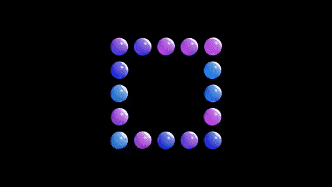
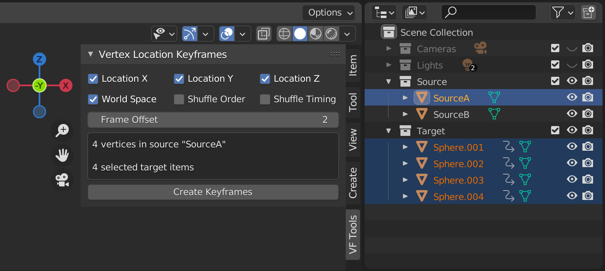
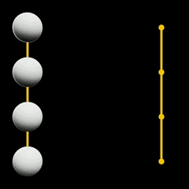
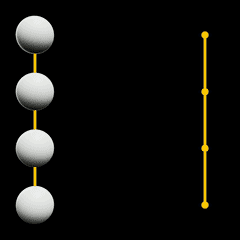
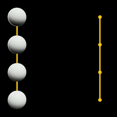
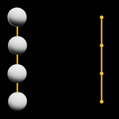

# VF Vertex Location Keyframes

Creates location keyframes for selected items based on vertices from a source mesh.

## Installation and Usage

- Download, install, and activate [VF_vertexLocationKeyframes.py](https://raw.githubusercontent.com/jeinselenVF/VF-BlenderVertexLocationKeyframes/main/VF_vertexLocationKeyframes.py)
- In object mode, select the target items
  - These can be items of any type, including empties, meshes, and lights
- Set the source mesh as the active object
  - This _must_ be a mesh object containing one or more vertices
  - The number of selected objects and the number of source mesh vertices should typically match, but the add-on will always work with the smaller of the two numbers
- Customise settings as needed, including frame offset
  - See the list of settings below for more details
- Navigate to the point in the timeline where you want the keyframes to start
- Click "Create Keyframes"
- Repeat as needed to build the entire animation sequence

If the order of the vertices isn't working for you, try re-sorting them using one of the available commands (while in edit mode) found in the `Mesh > Sort Elements` menu.

## Settings

- `Location X` toggles keyframing for the target item X channel (uncheck this if you want to preserve an existing location value)
- `Location Y` toggles keyframing for the target item Y channel (uncheck this if you want to preserve an existing location value)
- `Location Z` toggles keyframing for the target item Z channel (uncheck this if you want to preserve an existing location value)
- `World Space` determines if the vertex locations are relative to the source mesh object or to world space
- `Shuffle Order` randomises the order that target items are associated with source vertices
  - This can create a much more chaotic animation (see the examples below)
- `Shuffle Timing` randomises the sequence in which the target items animate
  - This can create more ordered chaos (see the examples below)
- `Frame Offset` increments the keyframe position of each item, starting at the current frame
  - Example: to create sequential keyframes for 4 items over a duration of 30 frames, this offset should be set to `10`
- The feedback box will show how many vertices are in the source mesh and how many target items are selected
- `Create Keyframes` will generate keyframes in the selected channels of all selected target items starting at the current frame

## Examples

### Frame Offset

With `Frame Offset` set to 0, the keyframes will all be set on the same frame.

With `Frame Offset` set to 5, each keyframe will be set 5 frames later than the previous.

### Shuffle Order

To create hold keyframes in a particular arrangement, keyframes must be duplicated in the timeline. Creating new keyframes from the same source mesh will result in a differently randomised order each time.

### Shuffle Timing

This can give a feeling of randomisation while still maintaining the reliability of known pairings between items and vertices. Note that it will also randomise the timing when transitioning from one set of vertex locations to another, since the timing order changes each time keyframes are generated (the elements will move at different speeds because their start and end keyframes aren't in the same sequential order).

### Paired with physics simulation

As demonstrated at the top, this is the intended purpose of the add-on; to help simplify a slightly complicated workflow. Though animating a source mesh using mesh keys while attaching target items with vertex groups works, it doesn't support sequential vertex delays and randomisation. This add-on is a plausible solution when forming shape arrays out of physically simulated objects.

In this case, the target items are passive rigid body objects with animation enabled, and the rendered objects are active rigid bodies, with each pair attached using spring constraints. Download the demo file to try it out for yourself.

[demo.blend](images/demo.blend)